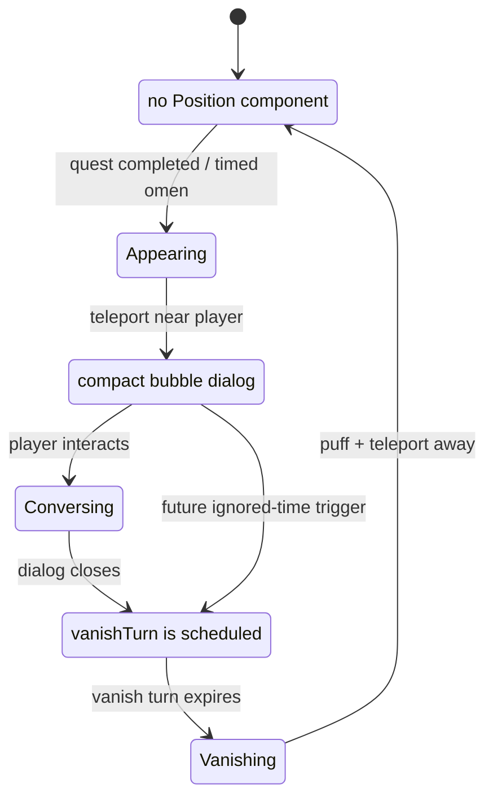

# Ratatoskr State Machine

Ratatoskr is a mythic messenger, not a resident town NPC. His
`norse:ratatoskr` encounter starts inactive and is activated by a relevant
starter quest completion. Once activated, he starts offstage, appears near the
player when the world has an omen to report, offers a compact interaction, then
vanishes several turns later. The encounter owns eligibility; this state
machine owns his roaming lifecycle.

